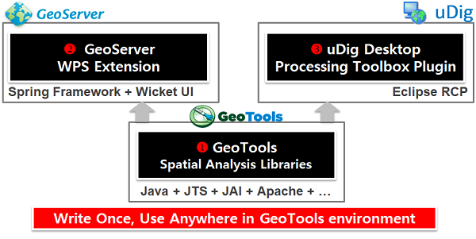

.. _mainindex:

=======================
OpenGXT 사용설명서
=======================

OGC 국제표준과 Open Source GIS에 기반하여 개발한 공간(통계)분석 엔진으로 3개의 프로젝트로 구성되어 있습니다.

  - GeoTools 기반의 공간(통계)분석 Library
  - GeoServer OGC WPS 지원 공간분석 Service Extension
  - uDig 기반의 공간분석 Processing Toolbox Plugin

OpenGXT는 오픈소스로 공개되어 있으며 GitHub에서 확인이 가능합니다.

  - `OpenGXT on GitHub <https://github.com/mangosystem/opengxt/>`_

목차
=================

.. toctree::
    :caption: OpenGXT 알아보기
    :maxdepth: 2

    about/index

.. toctree::
    :caption: OGC 서비스 이해하기
    :maxdepth: 2

    webprocessingservice/index

.. toctree::
    :caption: 설치하기
    :maxdepth: 2

    install/index

.. toctree::
    :caption: 시작하기
    :maxdepth: 2

    quickstart/index

.. toctree::
    :caption: 분석 프로세스
    :maxdepth: 2

    processes/index

.. toctree::
    :caption: 상업적 지원
    :maxdepth: 2

    support/index