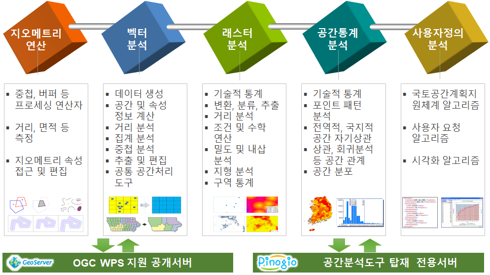

.. _processes:

Overview
========================

As of April 2020, we provide about 190 WPS processes including vector analysis, raster analysis, and spatial statistics analysis.

.. note:: It will be updated continuously.

Vector Data Analysis
========================

It consists of processes related to vector data analysis and processing, such as spatial unit creation, spatial and attribute calculation, extraction, overlay, distance, aggregation, generalization, editing, and vector processing tools.

.. toctree::
    :maxdepth: 2

    vector/index

Raster Data Analysis
========================

It consists of processes related to raster data analysis and processing, including raster descriptive statistics, transformation, classification, extraction, density, distance, math, interpolation, zonal statistics, projection, and terrain analysis.

.. toctree::
    :maxdepth: 2

    raster/index

Spatial Statistics
========================

It consists of processes related to spatial statistics analysis and processing, such as descriptive statistics, spatial distribution, point patterns, spatial autocorrelation, and spatial modeling.

.. toctree::
    :maxdepth: 2

    statistics/index
