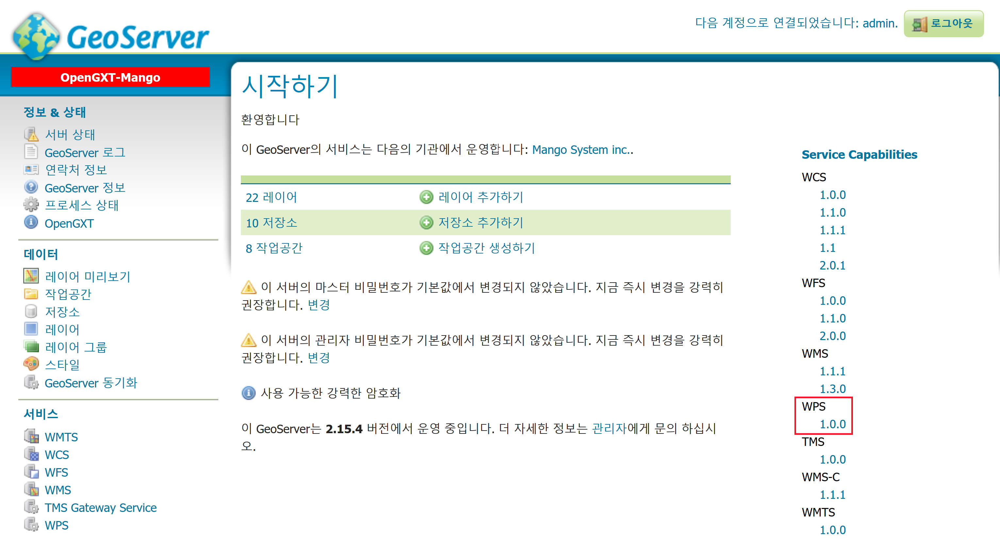
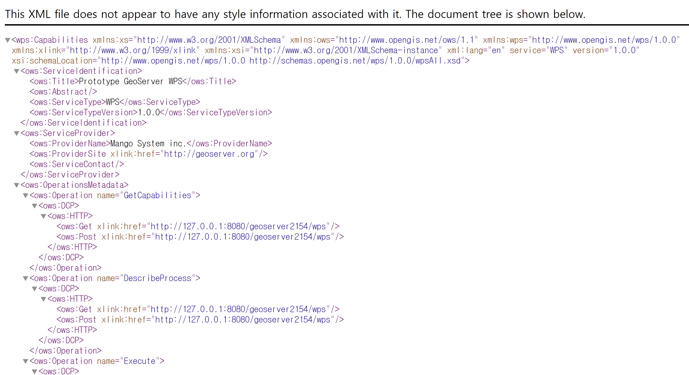
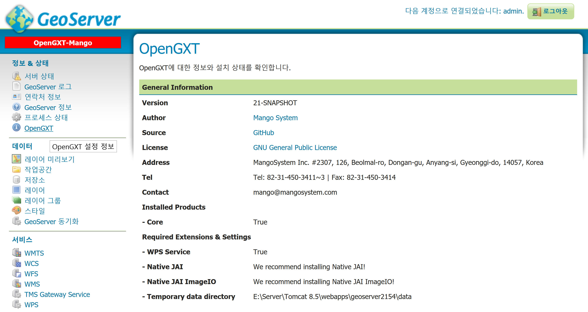
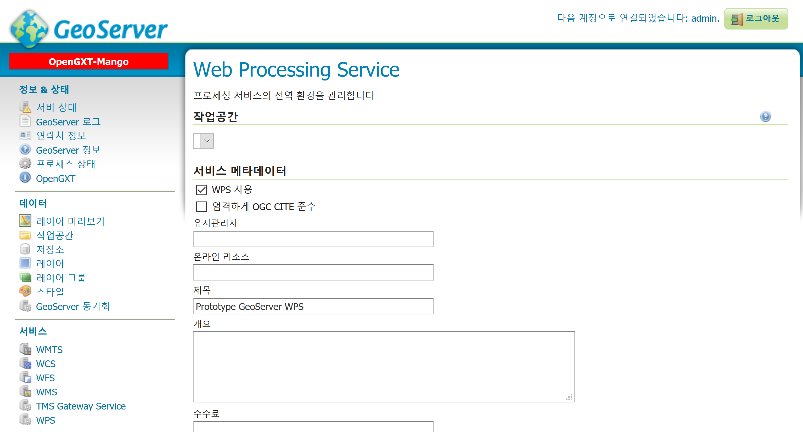
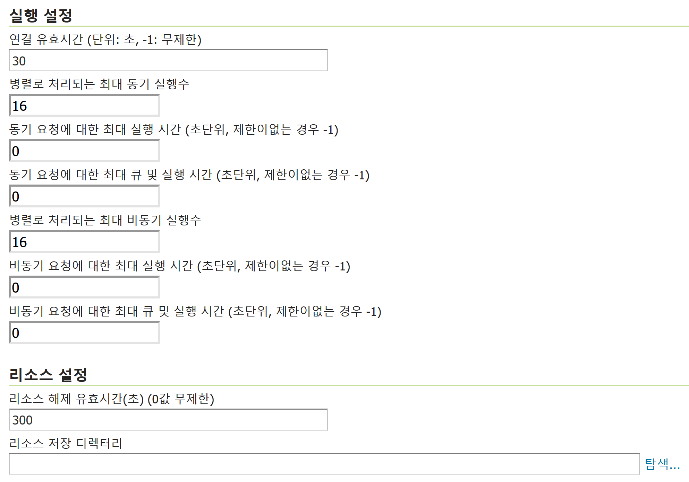
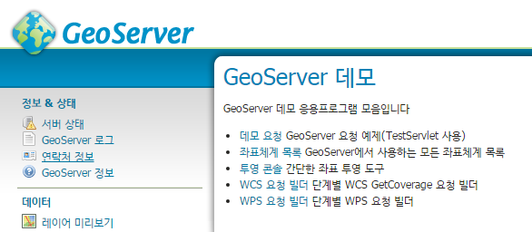
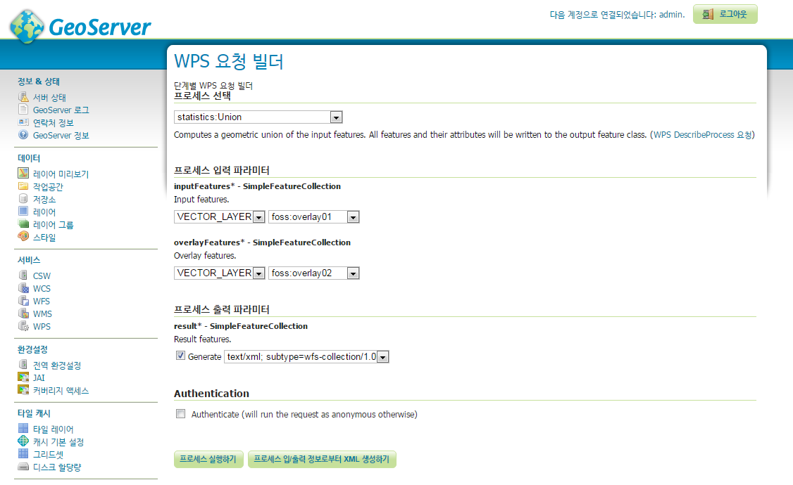
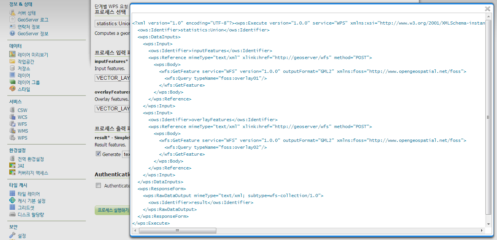

.. _quickstart:

GeoServer에서 시작하기
======================

Web Browser를 실행 후 GeoServer 관리자 페이지 URL로 이동합니다.

관리자 페이지
--------------
GeoServer에 로그인 후 시작 페이지의 오른쪽을 보면 현재 서비스 중인 OGC Web Service의 목록이 표시됩니다. 

이 목록들 중 WPS: 1.0.0 항목이 표시되면 GeoServer의 WPS Extension이 정상적으로 설치된 것입니다.
 

WPS: 1.0.0  항목을 클릭하면 다음과 같이 WPS의 GetCapabilities 문서를 확인할 수 있습니다.

OpenGXT 페이지
--------------

왼쪽의 메뉴 페이지에서 다음과 같이 [OpenGXT] 링크를 클릭하여 OpenGXT 설치 정보를 확인할 수 있습니다.

WPS 페이지
---------------

왼쪽의 메뉴 페이지에서 다음과 같이 [WPS] 링크를 클릭하여 Web Processing Service 페이지로 이동합니다. 

여기에서는 WPS 서비스의 활성화 여부, 서비스 메타데이터, 실행 설정 등의 환경을 설정할 수 있습니다.

 
아래로 스크롤 하면 다음의 [실행 설정] 탭이 보입니다. [연결 유효시간]은 기본값이 120초이며 이는 프로세스 실행 후 연결이 종료되는 시간입니다. 

WPS 프로세스의 처리 시간이 긴 경우 이 시간을 늘리면 됩니다. 
[리소스 설정]의 [리소스 유효시간] 기본값은 300초이며 이는 WPS 요청시 처리된 데이터를 서버에 남겨놓는 옵션(asReference를 True로 설정하여 요청하는 경우)을 설정한 경우 서버에 처리 결과를 보관하는 시간입니다.

더 많은 정보는 GeoServer 매뉴얼 [WPS Service page ] 편에서 확인할 수 있습니다.

WPS 요청 빌더
--------------

WPS Request Builder를 활용하는 예입니다. 

WPS Request Builder를 통해 GeoServer에서 제공하는 Process들의 메타데이터(DescribeProcess)와 파라미터(Data Input, Process Output)를 설정하거나 직접 실행 또는 다양한 WPS 요청문을 작성해 볼 수 있도록 구성되어 있습니다. 

우선 왼쪽의 메뉴 페이지에서 [데모] 페이지 링크를 클릭하여 다음과 같이 GeoServer 데모 페이지로 이동합니다.

 
[WPS 요청 빌더] 페이지의 [프로세스 선택] 콤보박스에서 하나의 프로세스를 선택합니다.
다음과 같이 선택한 프로세스의 파라미터 정보를 확인할 수 있습니다.

 
각각의 Input, Output 파라미터를 입력 후   버튼을 누르면 XML로 구성된 WPS 요청문을 확인할 수 있습니다. 
이렇게 생성된 요청문은 HTTP Post 방식으로 GeoServer에서 실행하고 결과 데이터를 활용할 수 있습니다.

파라미터 설정 후   버튼을 누르면 다음과 같이 처리 결과를 확인할 수 있습니다. 

다음 예는 2개의 폴리곤 레이어의 Union Overaly 분석을 수행 후 GeoJSON으로 출력한 예입니다.

 