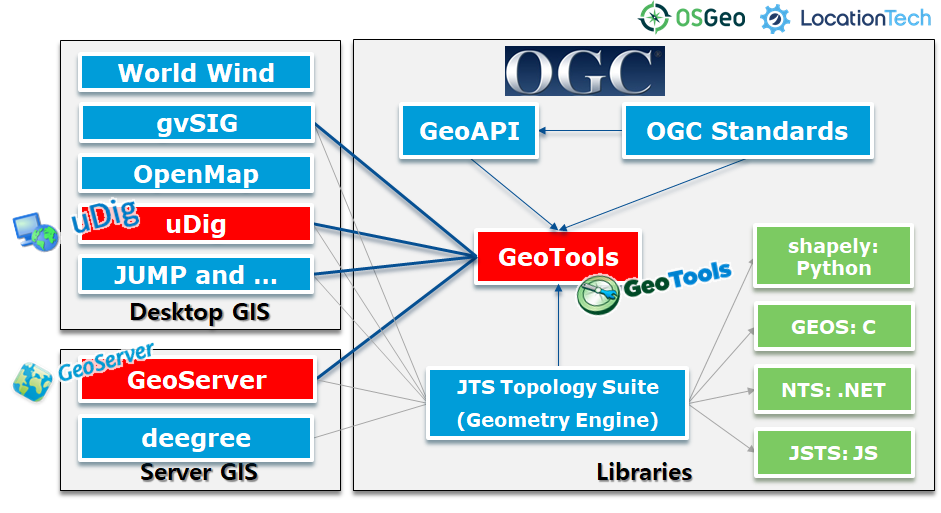
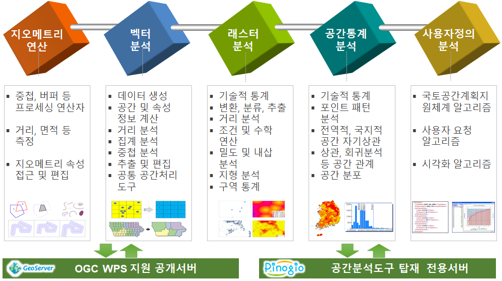
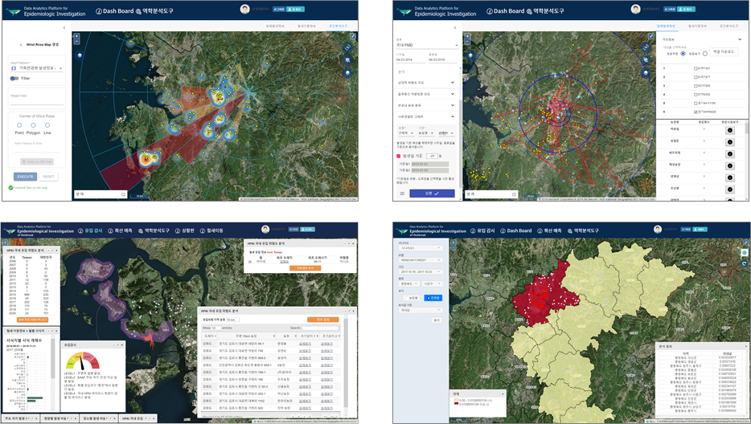
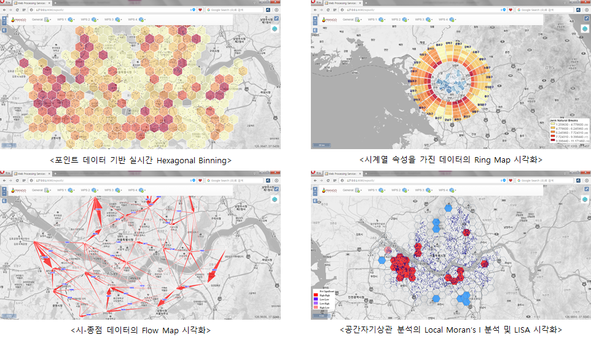

OpenGXT
===============

기반 오픈소스 GIS 프로젝트
-----------------------------

OpenGXT는 Java 기반 GeoTools(OSGeo) 라이브러리를 확장하여 개발되었으며, GeoServer (OSGeo)에서는 OGC WPS 서비스로, uDig(LocationTech)에서는 Processing Toolbox 플러그인으로 배포됩니다.

주요 공간분석 프로세스
-----------------------------

OpenGXT의 공간분석기능은 Geometry, 벡터, 래스터, 공간통계, 사용자 정의 알고리즘으로 구성되어 있으며, 2020년 현재 190여 개 분석 알고리즘이 배포되어 있습니다.

관련 문서
-----------------------------
**GeoTools Developer Guide**

  - `Korean v1.0 - 2MB(PDF) <https://github.com/mangosystem/opengxt/blob/master/docs/manual/GeoTools_Process_1.0_Developer_Guide_ko_v.1.0.pdf>`_  
  - `Korean v1.0-latest - 2MB(PDF) <https://github.com/mangosystem/opengxt/blob/master/docs/manual/GeoTools_Process_1.0_Developer_Guide_ko_v.1.latest.pdf>`_  

**GeoServer WPS Processes Manual**

  - `Korean v1.0 - 2MB(PDF) <https://github.com/mangosystem/opengxt/blob/master/docs/manual/GeoServer_WPS_1.0_User_Manual_ko_v.1.0.pdf>`_  
  - `Korean v2.x-latest - 33MB(PDF) <https://github.com/mangosystem/opengxt/blob/master/docs/manual/GeoServer_WPS_1.0_User_Manual_ko_v.2.latest.pdf>`_  
  - `English v2.x-latest - 21MB(PDF) <https://github.com/mangosystem/opengxt/blob/master/docs/manual/GeoServer_WPS_1.0_User_Manual_en_v.2.latest.pdf>`_  

**uDig Processing Toolbox Manual**

  - `Korean v2.0 - 28MB(PDF) <https://github.com/mangosystem/opengxt-udig-plugin/blob/master/docs/manual/uDig_ProcessingToolbox_1.0_User_Manual_ko_v.2.0.pdf>`_  
  - `Korean v3.x-latest - 35MB(PDF) <https://github.com/mangosystem/opengxt-udig-plugin/blob/master/docs/manual/uDig_ProcessingToolbox_1.0_User_Manual_ko_v.3.latest.pdf>`_  
  - `2018 OSGeo UN Committee Educational Challenge - Training Material for UN Open GIS Spiral 3(HTML) <https://wiki.osgeo.org/wiki/Training_Material_for_UN_Open_GIS_Spiral_3>`_  

관련 프로젝트
-----------------

  - `GeoTools <http://geotools.org>`_
  - `GeoServer <http://geoserver.org>`_
  - `uDig <http://locationtech.org/projects/technology.udig>`_  
  - `uDig Processing Toolbox <https://github.com/mangosystem/opengxt-udig-plugin>`_  

라이선스
=========

  - GeoTools process-spatialstatistics : `LGPL <http://www.gnu.org/licenses/lgpl.html>`_. `License guide <http://docs.geotools.org/latest/userguide/welcome/license.html>`_  
  - GeoServer gs-wps-spatialstatistics : `GPL <http://www.gnu.org/licenses/old-licenses/gpl-2.0.html>`_  
  - uDig org.locationtech.udig.processingtoolbox : `EPL <http://www.eclipse.org/legal/epl-v10.html>`_ + `BSD <http://udig.refractions.net/files/bsd3-v10.html>`_  

참여하기
============

OpenGXT는 소스코드에서부터, 지역화, 배포에 이르기까지 모든 과정이 공개되어 있으며, GitHub, Transifex, SourceForge 등 오픈소스를 지원하는 플랫폼을 활용합니다.

  - `GitHub <https://github.com/mangosystem/opengxt>`_  
  - `Transifex 지역화 <https://www.transifex.com/mangosystem/opengxt/dashboard>`_  
  - `SourceForge 배포 <https://sourceforge.net/projects/opengxt>`_  

활용사례
============

2018년 NIPA가 발주하고 국방지형정보단이 수요자인 [오픈소스 기반 군 공간정보 포털 시스템]입니다. 가이아쓰리디와 망고시스템이 수행했고 군에서 사용하는 지형분석 및 경로분석을 적용하였습니다.

2018년 한국교통안전공단이 발주한 [교통안전정보관리시스템(TMACS) 개선사업]에서 기존 데스크톱 기반의 교통사고분석시스템을 웹 기반 분석시스템으로 전환했습니다. 

2017년 동물질병 발병, 농장, 축산차량 이동정보 기반 역학조사 분석 시스템 및 2019년 인공지능기술을 활용한 고병원성 조류인플루엔자 국내 유입 감지 및 확산 대응 시스템에 적용하였습니다.

UN의 오픈소스 GIS 플랫폼 도입 프로젝트인 UN OpenGIS Initiative에서  Working Group 3 Geo-Analysis 부문에 참여하고 있으며 현재 분석기능 개발과 지원을 수행하고 있습니다.

데모 프로젝트

