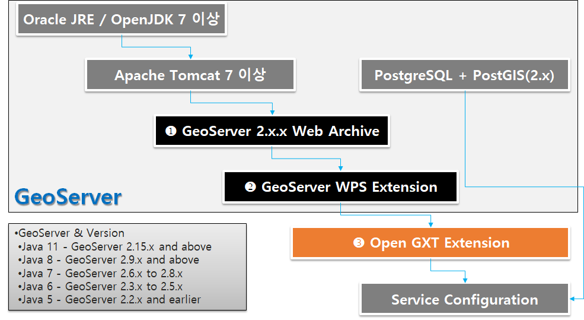

.. _install:

GeoServer에 설치하기
====================

1. GeoServer와 WPS Extension
------------------------------

GeoServer는 여러 방법으로 설치가 가능합니다.

여기에서는 일반적으로 가장 많이 활용되는 Apache Tomcat 환경에서 GeoServer를 설치하는 과정을 설명합니다. 
기타 과정에서 대해서는 GeoServer Online 매뉴얼을 참고하시기 바랍니다.

현재 [OpenGXT for Server]는 GeoServer 2.8 이후 버전을 모두 지원합니다.

다음은 GeoServer 2.20.3 버전을 기준으로 설치 과정을 설명합니다.

**1.1 Java and Tomcat**

GeoServer 2.8 버전 이하는 Java 7을, 2.9 버전 이후는 Java 8을 지원합니다. Java 설치 과정은 생략합니다.

Tomcat은 Java 7 또는 8 버전과 호환되는 버전을 사용하면 됩니다. Tomcat 설치 과정은 생략합니다.

.. list-table::
   :widths: 20 40 40

   * - **Java**
     - **GeoServer**
     - **비고**

   * - Java5
     - GeoServer 2.2.x and earlier
     - 

   * - Java6
     - GeoServer 2.3.x ~ 2.5.x
     - java7 호환
     
   * - Java7
     - GeoServer 2.6.x ~ 2.8.x
     - Java8 호환

   * - Java8
     - GeoServer 2.9.x and above
     - 

   * - Java11
     - GeoServer 2.20.x and above
     - 

**1.2 GeoServer and WPS Extension**

Tomcat에서 운영되는 GeoServer를 설치하려면 Web Archive 버전(war)을 다운로드 후 Tomcat webapps 폴더에 복사만 하면 됩니다. 
GeoServer 설치파일을 다운로드 하려면 우선 SourceForge  연결합니다.

다음의 URL에서 GeoServer와 WPS Extension을 다운로드 합니다.

  - GeoServer
  - https://sourceforge.net/projects/geoserver/files/GeoServer/2.20.3/geoserver-2.20.3-war.zip

다운로드 한 geoserver-2.20.3-war.zip 파일의 압축 해제 후 geoserver.war 파일을 Tomcat 설치 폴더의 webapps 폴더에 복사합니다. 
잠시 후 GeoServer가 설치됩니다.

  - WPS Extension
  - https://sourceforge.net/projects/geoserver/files/GeoServer/2.20.3/extensions/geoserver-2.20.3-wps-plugin.zip

다운로드 한 geoserver-2.20.3-wps-plugin.zip 파일의 압축 해제 후 포함된 모든 jar 파일을 webapps/geoserver/WEB-INF/lib 폴더 내에 복사합니다. 
이제 Tomcat 서비스를 재 시작 후 GeoServer 관리자 페이지로 이동하면 다음과 같이 정상적으로 WPS Extension이 설치된 것을 확인할 수 있습니다.

2. OpenGXT Extension
---------------------

GeoServer WPS Extension을 설치하면 Geometry, Vector, Raster 기본 WPS 프로세스가 제공되며, 이후 OpenGXT for Server 를 설치하면 약 200여개의 분석 프로세스가 추가됩니다.
우선 SourceForge 연결합니다. 

다음의 URL에서 OpenGXT for Server 설치파일을 다운로드 합니다.

  - OpenGXT for Server
  - https://sourceforge.net/projects/opengxt/files/GeoServer/
  - GeoServer-Extension-OpenGxT-2.20.x.zip

다운로드 및 압축 해제 후 2개의 jar 파일을 webapps/geoserver/WEB-INF/lib 폴더 내에 복사합니다. 
이제 Tomcat 서비스를 재 시작하면 설치가 완료됩니다.

