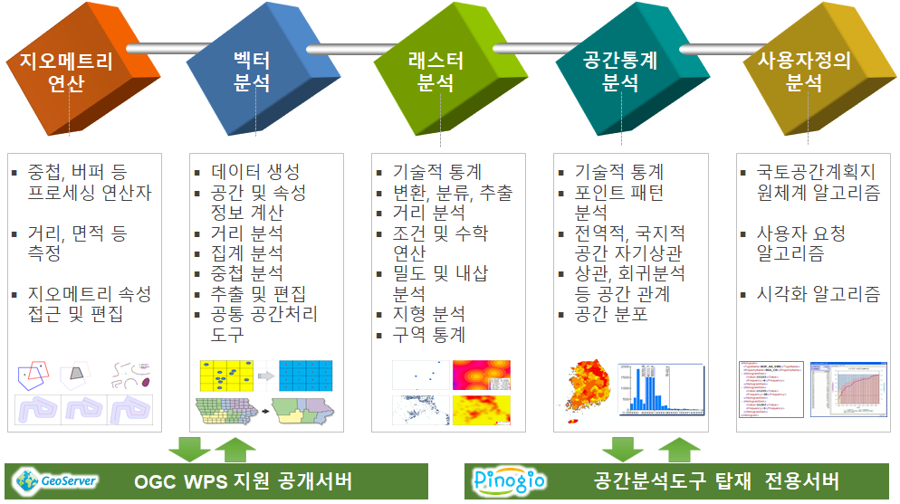

.. _processes:

분석 프로세스 개요
========================

현재 벡터 분석, 래스터 분석, 공간통계분석 등 약 190여개의 WPS 프로세스를 제공하고 있습니다.

.. note:: 분석 프로세스는 계속 추가됩니다.

벡터 데이터 분석
========================

공간단위 생성, 공간 및 속성 계산, 추출, 중첩, 거리, 집계, 일반화, 편집, 벡터 처리 도구 등 벡터 데이터 분석 및 처리와 관련된 프로세스들로 구성됩니다.

.. toctree::
    :maxdepth: 2

    vector/index

래스터 데이터 분석
========================

래스터 기술통계, 변환, 분류, 추출, 밀도, 거리, 수학, 내삽, 구역통계, 좌표변환, 지형분석 등 래스터 데이터 분석 및 처리와 관련된 프로세스들로 구성됩니다.

.. toctree::
    :maxdepth: 2

    raster/index

공간통계 분석
========================

기술통계, 공간분포, 포인트 패턴, 공간 자기상관, 공간 모델링 등 공간 통계 분석 및 처리와 관련된 프로세스들로 구성됩니다.

.. toctree::
    :maxdepth: 2

    statistics/index